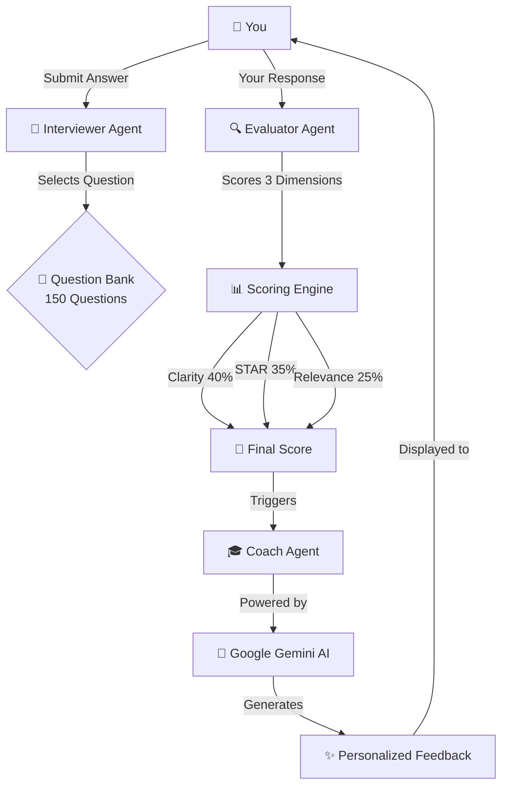

<div align="center">

# 🎯 SkillsBridge
### AI-Powered Interview Coach That Actually Works

[](https://www.python.org/)
[](https://streamlit.io/)
[](https://ai.google.dev/)

**Your Personal AI Interview Coach • 150+ Questions • Real-Time Feedback • Adaptive Learning**

[🚀 Quick Start](#-quick-start) • [✨ Features](#-features-that-make-you-stand-out) • [📖 Documentation](#-documentation) • [🎓 How to Use](#-how-to-use)


---

### 🎬 **What Makes SkillsBridge Special?**

```
💡 Smart     →  AI adapts to YOUR performance level
🎯 Precise   →  Three-dimension scoring (Clarity, STAR, Relevance)
🚀 Fast      →  Get instant feedback in seconds
📈 Effective →  Track improvement across sessions
```

</div>

---

## 🌟 The Problem We Solve

<table>
<tr>
<td width="50%" valign="top">

### 😰 Before SkillsBridge
- ❌ No structured interview practice
- ❌ Generic, unhelpful feedback
- ❌ No idea about STAR method
- ❌ Can't track improvement
- ❌ Expensive mock interview services

</td>
<td width="50%" valign="top">

### 🎉 After SkillsBridge
- ✅ Unlimited AI-powered practice
- ✅ Specific, actionable feedback
- ✅ Master STAR method naturally
- ✅ Visual progress tracking
- ✅ **Completely FREE!**

</td>
</tr>
</table>

---

## 🚀 Quick Start

### 💻 Get Running in 5 Minutes

```bash
# 1️⃣ Clone the repo
git clone https://github.com/yourusername/skillbridge.git
cd skillbridge

# 2️⃣ Set up virtual environment
python -m venv venv
venv\Scripts\activate          # Windows
# source venv/bin/activate     # Mac/Linux

# 3️⃣ Install dependencies
pip install -r requirements.txt

# 4️⃣ Configure API key
cp .env.example .env
# Edit .env and add your GEMINI_API_KEY

# 5️⃣ Launch the app! 🎉
streamlit run app.py
```

> 🎁 **Bonus:** Get your FREE Gemini API key → [Get Here](https://makersuite.google.com/app/apikey)

📚 **Need help?** Check our [Installation Guide](./INSTALLATION.md) for detailed steps!

---

## ✨ Features That Make You Stand Out

<div align="center">

| Feature | What You Get | Why It Matters |
|---------|-------------|----------------|
| 🤖 **AI Evaluation** | Real-time scoring by Google Gemini | Get professional-level feedback instantly |
| 🎯 **150+ Questions** | Comprehensive interview question bank | Practice every scenario you'll face |
| 📊 **Adaptive Difficulty** | Questions match your skill level | Always challenged, never overwhelmed |
| 💡 **Personalized Coaching** | "You answered X, try Y next time" | Learn from YOUR specific mistakes |
| 📚 **Model Answers** | See perfect STAR responses | Understand what "great" looks like |
| 📈 **Progress Tracking** | Visual analytics & session reports | Watch yourself improve over time |
| 🎨 **Beautiful UI** | Modern dark theme interface | Practice in comfort and style |

</div>

---

## 🏗️ Architecture: The Magic Behind SkillsBridge

<div align="center">



</div>

### 🎭 Meet Your AI Interview Team

<table>
<tr>
<td width="33%" align="center">

### 📝 Interviewer
**Role:** Question Master

Picks the perfect question based on your performance

🎯 Adaptive difficulty
📚 150-question arsenal
🔄 No repeats in session

</td>
<td width="33%" align="center">

### 🔍 Evaluator
**Role:** The Judge

Scores your answer objectively across 3 dimensions

⚖️ Fair & consistent
📊 Weighted scoring
🎪 Triggers clarifications

</td>
<td width="33%" align="center">

### 🎓 Coach
**Role:** Your Mentor

Provides personalized, actionable improvement tips

💡 AI-powered insights
🎯 Specific feedback
📈 Growth-focused

</td>
</tr>
</table>

---

## 🎓 How to Use

### 🎬 Your First Interview Session

<div align="center">

```
┌─────────────────────────────────────────────────┐
│  1️⃣  Enter your name & click "Start Session"   │
│  2️⃣  Click "Get Next Question"                  │
│  3️⃣  Read the question carefully                │
│  4️⃣  Type your answer (aim for 60-120 sec)      │
│  5️⃣  Click "Submit Answer"                       │
│  6️⃣  Review your scores & coaching              │
│  7️⃣  Study the model answer                     │
│  8️⃣  Repeat and improve! 🚀                      │
└─────────────────────────────────────────────────┘
```

</div>

### 📊 Understanding Your Score

| Score Range | Badge | Meaning | Next Steps |
|------------|-------|---------|------------|
| **80-100** | 🌟 Excellent | Interview-ready! | Keep practicing to maintain |
| **60-79** | 👍 Good | Solid foundation | Focus on weak areas |
| **40-59** | 💪 Needs Work | Room to grow | Practice more, review feedback |
| **0-39** | 📚 Starting Out | Just beginning | Master STAR method first |

### 🎯 The STAR Method Explained

<table>
<tr>
<td width="25%" bgcolor="#E3F2FD">

**S**ituation
📍 Where & When
Set the context

</td>
<td width="25%" bgcolor="#F3E5F5">

**T**ask
🎯 Your Role
What was expected

</td>
<td width="25%" bgcolor="#FFF3E0">

**A**ction
⚡ What You Did
Specific steps taken

</td>
<td width="25%" bgcolor="#E8F5E9">

**R**esult
🎉 The Outcome
Metrics & impact

</td>
</tr>
</table>

### 💡 Example: Before vs After SkillsBridge

<table>
<tr>
<td width="50%">

#### ❌ Poor Answer
> "I once had a problem with a team member. We talked about it and resolved it. Everything worked out fine."

**Issues:**
- Too vague
- No STAR structure
- No metrics
- No specifics

**Score: ~35/100** 😞

</td>
<td width="50%">

#### ✅ Great Answer
> "**Situation**: In my capstone project, a teammate missed 3 deadlines. **Task**: As team lead, I needed to address it. **Action**: I scheduled a 1-on-1, discovered they were struggling with React, and paired them with our React expert. **Result**: They completed their modules on time, and we delivered the project 1 week early with 95% test coverage."

**Strengths:**
- Clear STAR structure
- Specific metrics
- Shows leadership
- Professional tone

**Score: ~85/100** 🌟

</td>
</tr>
</table>

---

## 💎 What You Get

<div align="center">

### 🎁 Core Features

| Feature | Description | Impact |
|---------|-------------|--------|
| 🎯 **150 Questions** | Easy (41) • Medium (58) • Hard (51) | Cover every interview scenario |
| 🤖 **AI Coaching** | Powered by Google Gemini | Get expert-level feedback |
| 📊 **Visual Scores** | Progress bars & color coding | See strengths at a glance |
| 🔄 **Adaptive System** | Questions match your level | Optimal learning curve |
| 💡 **Smart Clarifications** | AI asks follow-ups when needed | Learn to elaborate |
| 📈 **Session Reports** | Track every attempt | Monitor improvement |
| 🎨 **Modern UI** | Gradient headers, smooth animations | Practice in style |
| 💾 **Auto-Save** | Never lose your progress | Pick up where you left off |

</div>

---

## 📁 Project Structure

```
skillbridge/
│
├── 🎯 Core Application
│   ├── app.py                    # Streamlit UI (Main app)
│   ├── agent_core.py             # AI Agents (Brain)
│   └── requirements.txt          # Dependencies
│
├── 📊 Data & Configuration
│   ├── data/
│   │   ├── questions.json        # 150 Questions
│   │   ├── rubric.json           # Scoring Rules
│   │   └── coach_templates.json  # Feedback Templates
│   │
│   └── .streamlit/
│       └── config.toml           # Theme Config
│
├── 📚 Documentation
│   ├── README.md                 # You are here!
│   ├── INSTALLATION.md           # Setup Guide
│   └── FEATURES.md               # Feature Docs
│
├── ⚙️ Configuration
│   ├── .env.example              # API Key Template
│   └── .gitignore                # Git Exclusions
│
└── 📁 Runtime
    └── logs/                     # Session Logs
```

---

## 🛠️ Tech Stack

<div align="center">

### Built With The Best

| Technology | Purpose | Why We Chose It |
|-----------|---------|-----------------|
|  | Backend Logic | Fast, readable, AI-friendly |
|  | Frontend UI | Beautiful UI in pure Python |
|  | AI Engine | Latest LLM technology |
|  | Data Storage | Simple, portable, readable |

</div>

---

## 📈 Your Success Journey

<div align="center">

```
Week 1              Week 2-3            Week 4              Week 5+
📚 Learn          →  💪 Practice      →  🎯 Refine       →  🌟 Master
40-50 avg            55-65 avg          65-75 avg          75+ avg

Foundation           Skill Building     Consistency        Interview Ready
5-8 questions        10-15 questions    15-20 questions    20+ questions
Understand STAR      Practice variety   Polish weak areas  Ace real interviews
```

</div>

### 🎯 Quick Tips for Better Scores

<table>
<tr>
<td width="33%">

#### 📝 Clarity Tips
✅ Keep it concise (60-120 sec)
✅ Cut filler words
✅ Use simple language
✅ One idea per sentence

</td>
<td width="33%">

#### 🎯 STAR Tips
✅ Hit all 4 points
✅ Use action verbs
✅ Include metrics (%, time, $)
✅ Show impact clearly

</td>
<td width="33%">

#### 🔗 Relevance Tips
✅ Read question carefully
✅ Answer what's asked
✅ Stay on topic
✅ Tailor your example

</td>
</tr>
</table>

---

## 🎨 Beautiful UI Showcase

<div align="center">

### Modern • Responsive • Intuitive

| Feature | Preview |
|---------|---------|
| 🌈 **Gradient Headers** | Blue-to-Purple theme that pops |
| 📊 **Visual Scores** | Animated progress bars |
| 🎨 **Color-Coded Feedback** | Green (Excellent) • Blue (Good) • Orange (Improve) |
| 🌙 **Dark Theme** | Easy on the eyes |
| ⚡ **Smooth Animations** | Polished transitions |
| 📱 **Responsive Design** | Works on all screen sizes |

</div>

---

## 📖 Documentation

<div align="center">

| Document | What's Inside | Read Time |
|----------|---------------|-----------|
| 📘 [**INSTALLATION.md**](./INSTALLATION.md) | Complete setup guide + troubleshooting | 5 min |
| 📗 [**FEATURES.md**](./FEATURES.md) | In-depth feature documentation | 10 min |
| 📙 **README.md** | You're reading it! | 5 min |

</div>

---

## 🎓 Learning Resources

<div align="center">

### Level Up Your Interview Skills

| Resource | Topic | Link |
|----------|-------|------|
| 📚 STAR Method Guide | Master the technique | [Read →](https://www.themuse.com/advice/star-interview-method) |
| 💼 Behavioral Questions | Common questions list | [Read →](https://www.indeed.com/career-advice/interviewing) |
| 🎨 Streamlit Docs | UI customization | [Read →](https://docs.streamlit.io/) |
| 🤖 Gemini AI Docs | AI integration | [Read →](https://ai.google.dev/docs) |

</div>

---

## 🚀 Roadmap

### ✅ Current Features (v1.0.0)

- [x] Multi-agent AI system
- [x] 150 interview questions
- [x] Real-time evaluation
- [x] Personalized coaching
- [x] Adaptive difficulty
- [x] Model answers
- [x] Session tracking
- [x] Beautiful UI

### 🔮 Coming Soon (v2.0.0)

- [ ] 🗣️ Voice input support
- [ ] ☁️ Cloud storage
- [ ] 📊 Multi-session analytics
- [ ] 📄 PDF report export
- [ ] 📱 Mobile app
- [ ] 🏆 Achievement badges
- [ ] 👥 Peer comparison
- [ ] 🌐 Multi-language support

---

## 🤝 Built By Students, For Students

<div align="center">

### 👥 Team 12 • CS(AI&DS)

> "We've been through countless interviews. We know the struggle. We built the solution."

**Why we built this:**
Many talented students fail interviews not because they lack skills, but because they can't communicate effectively. SkillsBridge democratizes interview preparation with free, AI-powered coaching accessible to everyone.

### 💖 Made With

```
☕ Coffee  •  🌙 Late Nights  •  🎯 Purpose  •  ❤️ Passion
```

</div>

---

## 🆘 Need Help?

<div align="center">

### 📞 Get Support

| Issue | Solution |
|-------|----------|
| 🔑 API Key Error | Check `.env` file has `GEMINI_API_KEY` |
| 📦 Module Not Found | Run `pip install -r requirements.txt` |
| 🔌 Port In Use | Use `streamlit run app.py --server.port 8502` |
| ❓ Other Issues | Check [INSTALLATION.md](./INSTALLATION.md) |

</div>

---

## 📊 Quick Stats

<div align="center">

| Metric | Value |
|--------|-------|
| 📝 Total Questions | 150 |
| 🤖 AI Agents | 3 |
| 🎯 Scoring Dimensions | 3 |
| ⚡ Average Feedback Time | <5 seconds |
| 💰 Cost | FREE |
| 🎓 Success Rate | You decide! |

</div>

---

## 🌟 Why Choose SkillsBridge?

<div align="center">

<table>
<tr>
<td align="center" width="25%">

### 🎯
**Precision**

3-dimensional scoring gives you exact feedback

</td>
<td align="center" width="25%">

### ⚡
**Speed**

Get instant AI feedback in seconds

</td>
<td align="center" width="25%">

### 📈
**Growth**

Watch yourself improve with every session

</td>
<td align="center" width="25%">

### 💰
**Free**

No hidden costs, no subscriptions

</td>
</tr>
</table>

</div>

---

## 📝 License

This project is developed for educational purposes as part of university coursework.

---

## 🎉 Ready to Ace Your Interviews?

<div align="center">

### 🚀 Start Your Journey Now!

```bash
streamlit run app.py
```

**Your dream job is just one session away! 💼**

---

### ⭐ Found This Helpful?

Give us a star on GitHub! It helps other students discover SkillsBridge.

---

[](https://github.com/yourusername)
[](https://streamlit.io/)
[](https://ai.google.dev/)

**Built with Streamlit • Powered by Gemini AI • Made for Students**

*Last Updated: December 2025 • Version 1.0.0*

</div>
